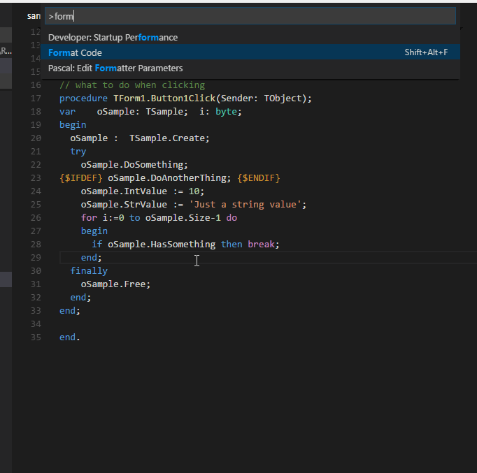

## Format Your Pascal Code

With your engine configured, you can now format Pascal files directly in VS Code.

### Format the entire document

Open a `.pas` file and use any of these methods:

* **Right-click** the editor → **Format Document**
* Keyboard shortcut: `Shift+Alt+F` (Windows/Linux) or `Shift+Option+F` (macOS)
* Command Palette: **Format Document**

### Format a selection

Select a portion of code, then:

* **Right-click** the selection → **Format Selection**
* Command Palette: **Format Selection**

> **Note:** Only **FreePascal PToP** supports selection formatting. Other engines will format the full document even when a selection is made.
